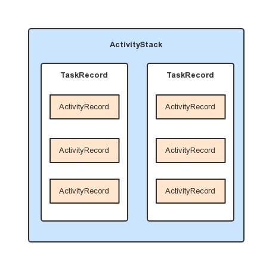

### 深入理解ActivityManagerService

#### AMS的启动过程

AMS的启动入口，在SystemServer的run方法中，看一下代码：

```java
    /**
     * The main entry point from zygote.
     */
    public static void main(String[] args) {
        new SystemServer().run();
    }

	public SystemServer() {
        // Check for factory test mode.
        mFactoryTestMode = FactoryTest.getMode();
    }

    private void run() {
      //一些手机本地化、虚拟机的设置
      
      // Initialize native services.
      System.loadLibrary("android_servers");
      
      // Initialize the system context.
      createSystemContext();
      
      // Create the system service manager.
      mSystemServiceManager = new SystemServiceManager(mSystemContext);
      LocalServices.addService(SystemServiceManager.class, mSystemServiceManager);
      
      // Start services.
      startBootstrapServices();
      startCoreServices();
      startOtherServices();
    }
```

先重点看一下createSystemContext方法：

```java
    private void createSystemContext() {
        ActivityThread activityThread = ActivityThread.systemMain();
        mSystemContext = activityThread.getSystemContext();
        mSystemContext.setTheme(DEFAULT_SYSTEM_THEME);
    }
```

在该方法内通过调用ActivityThread的systemMain()，启动运行在系统进程的ActivityThread代表系统进程的主线程，systemMain函数保证了系统进程(即system_server进程)和普通进程(直接调用ActivityThread的main函数)一样拥有一个完备的Android运行环境。

在`startBootstrapServices`方法中启动了AMS：

```java
        // Activity manager runs the show.
        mActivityManagerService = mSystemServiceManager.startService(
                ActivityManagerService.Lifecycle.class).getService();
```

通过调用SystemServiceManager的startService方法来启动AMS。具体的就是通过Lifecycle的类名(Lifecyle为AMS的静态内部类)反射调用，执行Lifecycle的构造函数拿到Lifecycle的实例，然后调用Lifecycle的onStart方法启动AMS，最后调用Lifecycle的getService方法返回AMS。Lifecycle的代码如下：

```java
    public static final class Lifecycle extends SystemService {
        private final ActivityManagerService mService;

        public Lifecycle(Context context) {
            super(context);
            mService = new ActivityManagerService(context);
        }

        @Override
        public void onStart() {
            mService.start();
        }

        public ActivityManagerService getService() {
            return mService;
        }
    }
```

AMS在启动过程中，先执行构造函数完成初始化，再执行start方法完成启动。

接着看，根据SystemServer的执行顺序，看看AMS还干了些什么事：(选取了一部分)

```java
   // Now that the power manager has been started, let the activity manager
   // initialize power management features.
   mActivityManagerService.initPowerManagement();

   // Set up the Application instance for the system process and get started.
   mActivityManagerService.setSystemProcess();
   
   mActivityManagerService.installSystemProviders();
   
   mActivityManagerService.setWindowManager(wm);

  // We now tell the activity manager it is okay to run third party
  // code.  It will call back into us once it has gotten to the state
  // where third party code can really run (but before it has actually
  // started launching the initial applications), for us to complete our
  // initialization.
  //最后执行AMS的systemReady方法，传入了一个回调的实现方法
  mActivityManagerService.systemReady(new Runnable() {
  	mActivityManagerService.startObservingNativeCrashes();
    
    startSystemUi(context);//启动SystemUI，contextImpl启动SystemUIService
    ....
  }
```

#### AMS内部执行流程

先看一下，AMS的setSystemProcess方法：

```java
    public void setSystemProcess() {
        try {   
          		//添加一些服务到ServiceManager
				ServiceManager.addService(Context.ACTIVITY_SERVICE, this, true);
            	ServiceManager.addService(ProcessStats.SERVICE_NAME, mProcessStats);
          	
          		//通过ActivityThread安装系统应用，ActivityThread由系统进程启动运行在系统进程中
                ApplicationInfo info = mContext.getPackageManager().getApplicationInfo(
                    "android", STOCK_PM_FLAGS | MATCH_SYSTEM_ONLY);
            	mSystemThread.installSystemApplicationInfo(info, getClass().getClassLoader());
          		
          		//保证AMS实现进程管理，该ProcessRecord代表system_server
          		ProcessRecord app = newProcessRecordLocked(info, info.processName, false, 0);
          
        } catch (PackageManager.NameNotFoundException e) {
            throw new RuntimeException(
                    "Unable to find android system package", e);
        }
```

AMS的installSystemProviders方法，主要是启动SettingProvider。

AMS的systemReady方法，完成系统就绪的必要工作，然后会启动Launcher、在回调中又会启动SystemUI。在该方法中，先判断AMS中的成员变量mSystemReady的值，如果为true，执行callback的run方法后，就直接返回了。

#### AMS中对Activity的管理

AMS从名字上就能看出来是对Activity的管理，AMS提供了几个重要的类(或数据结构)来管理Activity。

- ActivityRecord，记录一个Activity
- TaskRecord，用来表示Task
- ActivityStack，用来管理一系列Task
- ActivityStackSupervisor，该类是在4.4版本之后引入的，用来组织管理ActivityStack



*RecentApp以TaskRecord为单位来进行管理。*

Activity的四种LaunchMode：

- standard模式，设置了该启动模式的Activity在被启动时，会创建一个新的实例，即使在栈顶，也会重复创建新的实例。被启动的Activity与主Activity的TaskId保持一致。

- singleTop模式，设置了该启动模式的Activity在被启动时，顾名思义如果位于栈顶则不会重复创建，即onCreate、onStart方法不会被调用，此时onNetIntent方法会被调用。

  现在考虑这样一种情况：如果栈中有该被启动的Activity实例，但是该实例不在栈顶情况又如何呢？答案是，还会重新创建一个新的Activity实例。

- singleTask模式，设置了该启动模式的Activity在被启动时，如果栈中存在这个Activity的实例就会复用这个Activity，不管它是否位于栈顶，复用时，会将它上面的Activity全部出栈，并且会回调该实例的onNewIntent方法。

  我之前的理解的singleTask就是这样的，但其实忽略掉了一个很重要的问题。在AndroidManifest中配置Activity时有个属性值叫taskAffinity，该值的作用是指定任务栈(不同的任务栈有不同的TaskId， 不指定的话就是默认包名)。启动指定singleTask模式的Activity的过程还存在一个任务栈的匹配，启动时，会在自己需要的任务栈中寻找实例，这个任务栈就是通过taskAffinity属性指定。如果这个任务栈不存在，则会创建这个任务栈，创建新的Activity实例入栈到新创建的Task中去。 不指定的话就是默认包名。

  我们可以将两个不同App中的Activity设置为相同的taskAffinity，这样虽然在不同的应用中，但是Activity会被分配到同一个Task中去

  **taskAffinity属性不对standard和singleTop模式有任何影响，即时你指定了该属性为其他不同的值，这两种启动模式下也不会创建新的task**

- singleInstance模式，该模式具备singleTask模式的所有特性外，与它的区别就是，这种模式下的Activity会单独占用一个Task栈，具有全局唯一性，即整个系统中就这么一个实例，由于栈内复用的特性，后续的请求均不会创建新的Activity实例，直接调用onNewIntent方法，除非这个特殊的任务栈被销毁了。这个模式的典型应用场景时，在手机某个APP(如短信)点击链接跳转到浏览器。

除了上述几种启动模式，接着了解下面这几个Intent标签的用法：

- FLAG_ACTIVITY_NEW_TASK
- FLAG_ACTIVITY_CLEAR_TOP
- FLAG_ACTIVITY_SINGLE_TOP


参考资料：[彻底弄懂Activity四大启动模式](http://blog.csdn.net/mynameishuangshuai/article/details/51491074)、[Tasks and Back Stack](https://developer.android.com/guide/components/tasks-and-back-stack.html)

#### AMS启动Activity的流程分析

直接从AMS的startActivity开始分析，在该方法内部拿到IApplicationThread、TaskRecord的实例后又调用到ActivityStarter中的startActivityMayWait函数。