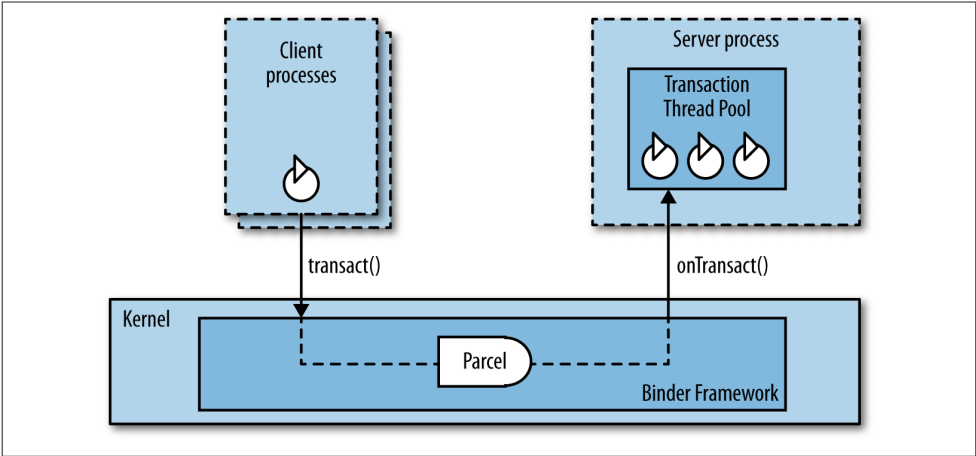

#### 概述

进程间通信（interprocess communication，IPC），是Android系统中的一个重要组件（high-level components ），常用的方式有：intent、系统服务、ContentProvider、Broadcast等。这些为应用开发提供了便利的进程间通信。这些功能的底层实现则依赖于binder框架。本文就在这里讲述一下，Binder框架中与Java层相关的代码实现。

#### Binder

Android实现进程间通信的基础是Binder驱动，通过Binder我们可以传输函数和数据， 客户端流程调用`transact `方法，而服务器进程接收调用 onTransact方法。整体流程如下图：



我们首先看看Binder框架中涉及到Java层的类有：

```java
/**
 * 通过AIDL实现的接口会继承该接口
 */
public interface IInterface {
    public IBinder asBinder();
}

public interface IBinder {
  // ...
  
  public IInterface queryLocalInterface(String descriptor);
  
  public boolean transact(int code, Parcel data, Parcel reply, int flags)
    throws RemoteException;
  
  // 这两个函数定义了Binder的死亡通信机制
  public void linkToDeath(DeathRecipient recipient, int flags)
    throws RemoteException;
  public boolean unlinkToDeath(DeathRecipient recipient, int flags);
  // ...
}

public class Binder implements IBinder {
  // ...
  
  public static final native long clearCallingIdentity();
  
  public static final native void restoreCallingIdentity(long token);
  
  public void attachInterface(IInterface owner, String descriptor) {
    mOwner = owner;
    mDescriptor = descriptor;
  }
  
  public IInterface queryLocalInterface(String descriptor) {
    if (mDescriptor.equals(descriptor)) {
      return mOwner;
    }
    return null;
  }
  
  // ...
}

// 该类存在于 base\core\java\android\os\Binder.java中，与Binder类在一个文件中
// 代表一个远程的Binder对象
final class BinderProxy implements IBinder {
}

//要实现进程间通信的类，需要继承Binder。比如ActivityManagerService的父类：
//IActivityManager继承了IInterface接口

//ActivityManagerNative通过ServiceManager.getService("Activtiy")获取到了和ActivityManager交互的IBinder对象，并使用它创建了应用程序的ActivityManagerProxy
public abstract class ActivityManagerNative extends Binder implements IActivityManager{}
```

在Java层Binder框架中，Bp端通过BinderProxy的transact()方法向Bn端发送请求，Bn端通过继承Binder类并重写onTransact()来接受Bp端的请求以实现具体业务。

#### AIDL

在Android中所有的进程运行在独立的空间，要想实现进程间相互通信可以借助于**AIDL**。
AIDL是`Android Interface definition language`的缩写，它是一种Android内部进程通信接口的描述语言，通过它我们可以定义进程间的通信接口。

AIDL支持的数据类型有：

- Java中的八种基本数据类型( byte，short(不支持short，编译不通过)，int，long，float，double，boolean，char)

- String 和 CharSequence类型

- List ： List中的所有元素必须是AIDL支持的类型之一，里面的每个元素都必须能够被AIDL支持

- Map ： Map中的所有元素必须是AIDL支持的类型之一，包括key和value

- Parcelabel : 所有实现了Parcelabel 接口的对象

- AILD : 所有的AIDL接口本身也可以在AIDL文件中使用

- AIDL，数据传输复杂数据类型时，实现序列化

  > ```java
  > // 定义Person.aidl文件
  > package com.remote.aidl;
  > parcelable Person;
  >
  > // 定义Person.java文件
  > package com.remote.aidl;
  > public class Person implements Parcelable {
  > }
  >
  > // 定义接口 IPersonManager.aidl 文件，在客户端获得 List<Person>
  > package com.remote.aidl;
  > import com.remote.aidl.Person;
  > interface IPersonManager {
  > 	List<Person> getPersonList();
  > }
  >
  > /**
  > * 以上三个文件要在服务端和客户端各存一份，包名要相同！！！
  > **/
  > ```

定义一个AIDL文件，**IIntentReceiver.adil**：

```java
oneway interface IIntentReceiver {
    void performReceive(in String intent, int resultCode, String data,
            in String extras, boolean ordered, boolean sticky, int sendingUser);
}
```

其中（基本数据类型不需要加此标识，非基本数据类型必须要加）：

**in :** 客户端数据对象流向服务端，并且服务端对该数据对象的修改不会影响到客户端。

**out :** 数据对象由服务端流向客户端，（客户端传递的数据对象此时服务端收到的对象内容为空，服务端可以对该数据对象修改，并传给客户端）

**oneway** ：oneway 关键字用于修改远程调用的行为：

- oneway 用于本地调用，则不会有任何影响，调用仍是同步调用
- 使用该关键字时，远程调用不会阻塞；它只是发送事务数据并立即返回。接口的实现最终接收此调用时，是以正常远程调用形式将其作为来自 Binder 线程池的常规调用进行接收

*使用oneway关键字时，返回值只能为void，不能有 out或者inout关键字，获取远程调用的结果只能通过远程回调的方式*

通过SDK目录下的AIDL命令，将aidl文件生成java文件：

```java
// <SDK Path>\build-tools\26.0.2<SDK版本号>\aidl.exe
// 通过终端，输入：
> aidl IIntentReceiver.adil
```

生成java文件如下所示：

```java
/*
 * This file is auto-generated.  DO NOT MODIFY.
 * Original file: E:\\demo\\IIntentReceiver.aidl
 * 自动生成的文件，不要修改
 */
public interface IIntentReceiver extends android.os.IInterface {
    /**
     * Local-side IPC implementation stub class.
     */
    public static abstract class Stub extends android.os.Binder implements IIntentReceiver {
      	// Binder 的唯一标识
        private static final java.lang.String DESCRIPTOR = "IIntentReceiver";

        /**
         * Construct the stub at attach it to the interface.
         * 构造函数调用，Binder类的 attachInterface 方法
         */
        public Stub() {
            this.attachInterface(this, DESCRIPTOR);
        }

        /**
         * 静态方法， 返回本地 IIntentReceiver 的实例
         *	1、如果是本地调用(没有跨进程)，直接返回该接口实例
         *	2、如果是跨进程调用，创建proxy，通过代理的方式调用接口中的方法
         * 当用户调用IIntentReceiver 接口的 performReceive 方法时，就会调用远程的实现
         */
        public static IIntentReceiver asInterface(android.os.IBinder obj) {
            if ((obj == null)) {
                return null;
            }
            android.os.IInterface iin = obj.queryLocalInterface(DESCRIPTOR);
            if (((iin != null) && (iin instanceof IIntentReceiver))) {
                return ((IIntentReceiver) iin);
            }
            return new IIntentReceiver.Stub.Proxy(obj);
        }

      	// 重写 asBinder 方法， 返回当前的binder对象
        @Override
        public android.os.IBinder asBinder() {
            return this;
        }

      	// 重写Binder中的 onTransact 方法，该方法运行在远程服务端的Binder线程池中
        @Override
        public boolean onTransact(int code, android.os.Parcel data, android.os.Parcel reply,
                         	int flags) throws android.os.RemoteException {
          	// code 标识了本地所进程所请求的目标方法
            switch (code) {
                case INTERFACE_TRANSACTION: {
                    reply.writeString(DESCRIPTOR);
                    return true;
                }
                case TRANSACTION_performReceive: {
                    data.enforceInterface(DESCRIPTOR);
                    java.lang.String _arg0;
                    _arg0 = data.readString();
                    int _arg1;
                    _arg1 = data.readInt();
                    java.lang.String _arg2;
                    _arg2 = data.readString();
                    java.lang.String _arg3;
                    _arg3 = data.readString();
                    boolean _arg4;
                    _arg4 = (0 != data.readInt());
                    boolean _arg5;
                    _arg5 = (0 != data.readInt());
                    int _arg6;
                    _arg6 = data.readInt();
                    this.performReceive(_arg0, _arg1, _arg2, _arg3, _arg4, _arg5, _arg6);
                    return true;
                }
            }
            return super.onTransact(code, data, reply, flags); // 如果返回false，表示远程调用失败
        }

        // 该内部类用以发起远程调用
        private static class Proxy implements IIntentReceiver {
            private android.os.IBinder mRemote;

            Proxy(android.os.IBinder remote) {
                mRemote = remote;
            }

            @Override
            public android.os.IBinder asBinder() {
                return mRemote;
            }

            public java.lang.String getInterfaceDescriptor() {
                return DESCRIPTOR;
            }

          	// 该方法运行在本地进程，通过mRemote.transact发起远程调用，当前线程会阻塞
            @Override
            public void performReceive(java.lang.String intent, int resultCode,
                             java.lang.String data, java.lang.String extras,              									 boolean ordered, boolean sticky, int sendingUser)
              				 throws android.os.RemoteException {
                android.os.Parcel _data = android.os.Parcel.obtain();
                try {
                    _data.writeInterfaceToken(DESCRIPTOR);
                    _data.writeString(intent);
                    _data.writeInt(resultCode);
                    _data.writeString(data);
                    _data.writeString(extras);
                    _data.writeInt(((ordered) ? (1) : (0)));
                    _data.writeInt(((sticky) ? (1) : (0)));
                    _data.writeInt(sendingUser);
                    // 调用此方法发起远程调用，远程服务端的 Stub 中触发onTransact
                    mRemote.transact(Stub.TRANSACTION_performReceive, _data, null,
                                     android.os.IBinder.FLAG_ONEWAY);
                } finally {
                    _data.recycle();
                }
            }
        }

        static final int TRANSACTION_performReceive = (android.os.IBinder.FIRST_CALL_TRANSACTION 
                                                       + 0);
    }

    public void performReceive(java.lang.String intent, int resultCode, java.lang.String data, 
                               java.lang.String extras, boolean ordered, boolean sticky, 
                               int sendingUser) throws android.os.RemoteException;
}
```

下面看看由aidl生成的java文件组成：

`IIntentReceiver`为接口类，继承自`IInterface`。

- 该接口有一个方法，即在aidl中定义的方法：`performReceive`
- 该接口中有一个静态抽象类`Stub`，继承自`Binder`并实现了这个接口。该抽象类中又包含了一个静态类`Proxy`，也实现了这个接口


有了这个AIDL我们可以在服务进程中，实现该接口：

```java
private final IIntentReceiver.Stub mBinder = new IIntentReceiver.Stub {
    
  @Override
  void performReceive(in String intent, int resultCode, String data,
                      in String extras, boolean ordered, boolean sticky, int sendingUser) {
      Log.d(TAG, " only test");
  }
}
```

我们可以通过Service的方式把这个`mBinder`返回到启动Service的进程（覆写onBind方法），实现Service这个独立进程与启动进程间的通信：

```java
Class RemoteService extends Service{
    
      private final IRemoteService.Stub mBinder = new IRemoteService.Stub() {
        @Override
        public int someOperate(int a, int b) throws RemoteException {
            Log.d(TAG, "called RemoteService someOperate()");
            return a + b;
        }
    };
  
  	@Override
    public IBinder onBind(Intent intent) {
        return mBinder; // 注意这里返回mBinder
    }
}
```

通过`bindService`的方式启动Service：

```java
Intent intent = new Intent();
ComponentName componentName = new ComponentName("com.remote.service",
                                                "com.remote.service.RemoteService");
intent.setComponent(componentName);
bindService(intent, serviceConnection, Context.BIND_AUTO_CREATE));

private IRemoteService mRemoteService;

private ServiceConnection serviceConnection = new ServiceConnection() {

  @Override
  public void onServiceConnected(ComponentName name, IBinder service) {
    Log.d(TAG, "onServiceConnected");
    mRemoteService = IIntentReceiver.Stub.asInterface(service);
  }

  @Override
  public void onServiceDisconnected(ComponentName name) {
    Log.i(TAG, "Service Disconnected");
    mRemoteService = null;
  }
};
```


通过aidl命令，生成的文件：RemoteService.Stub这个抽象类代表Bn端；通过RemoteService.Stub的asInterface()方法获得Bp端。
