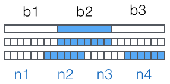

加密算法

#### MD5

MD5，Message-Digest Algorithm 5（信息-摘要算法5）。该算法是为了确保数据的传输完整性。MD5算法会对内容进行运算，产生一个固定长度（32位）的十六进制字符串值。该固定长度的十六进制数值，就作为该内容的”数字指纹“。标识该内容的唯一性，对内容改动哪怕一个字节，MD5值也会发生变化。

比如：微信的聊天记录文件：EnMicroMsg.db文件就是用：MD5加密的。

它的加密方式是：`key = md5(imei+uid)[:7]` 。即：imei号和uid拼接加密后的前7位。

> EnMicroMsg.db，位于手机：/data/data/com.tencent.mm/MicroMsg/<微信号>/EnMicroMsg.db
>
> uid可在/data/data/com.tencent.mm/shared_prefs/auth_info_key_prefs.xml里查看。key值为：_auth_uin

按照微信的加密公式，使用Python实现对聊天数据库的加密：

```python
#!/usr/bin/env python
# -*- coding: UTF-8 -*-

import hashlib
# 两个IMEI号，依次尝试
imei = (860952030006747, 860952030009741)
uid = 709076930

if __name__ == '__main__':
    str1 = str(imei[0]) + str(uid)
    # 调用hashlib库下的md5方法进行加密
    md = hashlib.md5(str1.encode()).hexdigest()[0:7]
    # md即为加密的秘钥
    print(md)

```

借助于工具：SQLCipher.exe和刚才得到的密钥，可以加密数据库，得到聊天信息。

#### Base64

Base64编码，Base64不能算作是一种加密算法，它是一种编码算法。

Base64可以将二进制数据编码为可打印的字符（ASCII字符），方便在只支持文本的环境中也能够顺利地传输二进制数据。具体过程如下：

- 将二进制数据划分为3个字节一组（3\*8=24bit），然后再划分为4组，每组是6bit（4\*6=24bit)。

  

  > 如果要编码的二进制数据不是3的倍数，最后会剩下1个或2个字节怎么办？Base64用`\x00`字节在末尾补足后，再在编码的末尾加上1个或2个`=`号，表示补了多少字节，解码的时候，会自动去掉。

- 根据新产生的索引，去查一个包含64个字符的数组表，获得相应的4个字符。

  数组表定义如下：

  ```javascript
  ['A', 'B', 'C', ... 'a', 'b', 'c', ... '0', '1', ... '+', '/']
  ```

  比如一些网站提供的迅雷下载地址，就需要使用迅雷的改造的Base64编码算法进行编码：首先，在地址的前后分别添加AA和ZZ；然后，对新的字符串进行Base64编码。
  
  参考地址：https://blog.csdn.net/qq_20545367/article/details/79538530

#### AES加密

高级加密标准(简称AES，Advanced Encryption Standard)为最常见的**对称加密算法**。

加密函数如下，因为是对称加密，通过秘钥`K` 也就可以进行解密了。

```
C = E(K, P),其中P为明文，K为密钥，C为密文
```

AES为分组密码，分组密码也就是把明文分成一组一组的，每组长度相等，每次加密一组数据，直到加密完整个明文。在AES标准规范中，明文分组长度只能是128位，也就是说，**每个分组为16个字节**。但是秘钥的长度可以使用128位、192位或者256位。我们这里选用128位的秘钥长度，加密轮数为10轮。

##### 基本原理

AES的处理单位是字节，明文和密钥都为16个字节。

1. 明文处理，将明文放入到4*4的矩阵中，称之为状态矩阵，每一轮加密，状态矩阵都会发生变化；

2. 密钥处理，先将密钥放入到4*4矩阵中，然后取**每一列**分别放入到：W[0],W[1],W[2],W[3]。然后再将W扩展到W[43]。因为有10轮加密，每一轮取W[i]-W[i+3]（i取值为[0,40]），与明文的状态矩阵进行加密。

3. 加密过程，每一轮的加密包括：字节代换、行移位、列混合、轮密钥加

参考：《现代密码学教程》、[AES加密算法的详细介绍与实现](https://blog.csdn.net/qq_28205153/article/details/55798628)

##### 代码实现

如果按照原理自己实现加密过程还是很繁琐的，我们可以直接使用Java扩展类库提供的相关函数完成AES加密和解密。比如对一个字符串进行AES加密和解密：

```java
import javax.crypto.Cipher;
import javax.crypto.spec.SecretKeySpec;

// 加密密钥，和服务器协商后妥善保管
public static final String AES_KEY = "613xBf6bgr78V9pc";
// 加密算法集
private static final String AES_ALGORITHM = "AES/ECB/PKCS5Padding";

public byte[] getAesByte(String str) {
    encrypt(str.getBytes("UTF-8"), AES_KEY.getBytes("UTF-8"));
}

// 加密过程
public static byte[] encrypt(byte[] data, byte[] key) {
    CheckUtils.notEmpty(data, "data");
    CheckUtils.notEmpty(key, "key");
    if (key.length != 16) {
        throw new RuntimeException("Invalid AES key length (must be 16 bytes)");
    }
    try {
        // 转为为AES专用密钥
        SecretKeySpec seckey = new SecretKeySpec(new SecretKeySpec(key, "AES")
                                                 .getEncoded(), "AES");
        // 创建密码器
        Cipher cipher = Cipher.getInstance(AES_ALGORITHM);
        // 初始化为加密模式的密码器
        cipher.init(Cipher.ENCRYPT_MODE, seckey);
        // 加密
        return cipher.doFinal(data);
    } catch (Exception e) {
        throw new RuntimeException("encrypt fail!", e);
    }
}

// 解密过程
public static byte[] decrypt(byte[] data, byte[] key) {
    CheckUtils.notEmpty(data, "data");
    CheckUtils.notEmpty(key, "key");
    if (key.length != 16) {
        throw new RuntimeException("Invalid AES key length (must be 16 bytes)");
    }
    try {
        SecretKeySpec seckey = new SecretKeySpec(new SecretKeySpec(key, "AES")
                                                 .getEncoded(), "AES");
        Cipher cipher = Cipher.getInstance(AES_ALGORITHM);
        cipher.init(2, seckey);
        return cipher.doFinal(data);
    } catch (Exception e) {
        throw new RuntimeException("decrypt fail!", e);
    }
}

```

