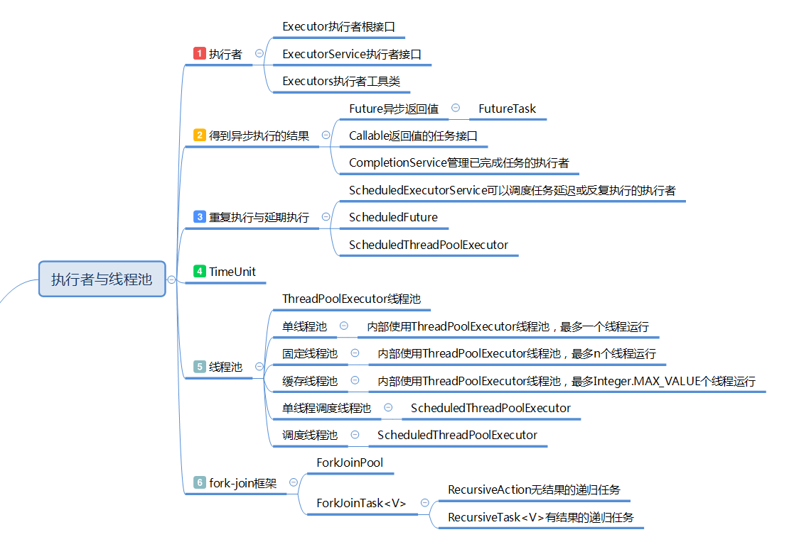

### Android多线程编程

我们不可能把事情都放在主线程上执行，这样会造成严重卡顿（ANR），那么这些事情应该交给子线程去做，但对于一个系统而言，创建、销毁、调度线程的过程是需要开销的，所以我们并不能无限量地开启线程，那么对线程的了解就变得尤为重要了。首先了解下Java中的多线程编程。

#### 一、Java中的多线程编程

JDK1.4之前，线程的创建还是依靠Thread、Runnable和Callable（新加入）对象的实例化；Concurrency包出现之后，线程的执行则靠Executor、ExecutorService的对象执行execute()方法或submit()方法；线程的调度则被固化为几个具体的线程池类，如ThreadPoolExecutor、ScheduledThreadPoolExecutor、ExecutorCompletionService等等。这样表面上增加了复杂度，而实际上成功将线程的**创建、执行和调度**的业务逻辑分离，使程序员能够将精力集中在线程中业务逻辑的编写，大大提高了编码效率，降低了出错的概率，而且大大提高了性能。



#### 1、线程的执行者

这个功能主要由三个接口和类提供，分别是： 

- Executor：执行者接口，所有执行者的父类，只包含一个方法：

```jav
void execute(Runnable command);
```

- ExecutorService：执行者服务接口，继承自Executor接口，具体的执行者类都继承自此接口：

```java
public abstract class AbstractExecutorService implements ExecutorService

public class ThreadPoolExecutor extends AbstractExecutorService
//ThreadPoolExecutor的构造函数
public ThreadPoolExecutor(int corePoolSize,
                          int maximumPoolSize,
                          long keepAliveTime,
                          TimeUnit unit,
                          BlockingQueue<Runnable> workQueue)
```

- Executors：执行者工厂方法类，大部分执行者的实例以及线程池都由它的工厂方法创建。

```java
    ExecutorService service = Executors.newCachedThreadPool();
    service.execute(new Task1());//Task1是Runnable接口的实现类
    service.shutdown();//阻止继续提交其他线程，并等待执行中的线程结束

    class Task1 implements Runnable{
        @Override
        public void run() {
            // TODO Auto-generated method stub
            System.out.println("task1");
    }
```

##### 2、开启线程的方式

- 继承Thread类，实现run方法；
- 实现Runnable接口
- 实现Callable接口，可以得到异步线程的执行结果

```java
/**
在Java Concurrency中，得到异步结果有了一套固定的机制，即通过Callable接口、Future接口和ExecutorService的submit方法来得到异步执行的结果
Callable：泛型接口，与Runnable接口类似，它的实例可以被另一个线程执行，内部有一个call方法，返回一个泛型变量V;
Future：泛型接口，代表依次异步执行的结果值，调用其get方法可以得到一次异步执行的结果，如果运算未完成，则阻塞直到完成；调用其cancel方法可以取消一次异步执行；
**/
     ExecutorService service = Executors.newCachedThreadPool();
        //
        Future<Integer> future = service.submit(new Callable<Integer>() {

            @Override
            public Integer call() throws Exception {
                // TODO Auto-generated method stub
                return 11;
            }
        });
        service.shutdown();
        try {
            //获取异步执行的结果，并捕获异常
            System.out.println("the value is=" + future.get());
        } catch (InterruptedException e) {
            // TODO Auto-generated catch block
            e.printStackTrace();
        } catch (ExecutionException e) {
            // TODO Auto-generated catch block
            e.printStackTrace();
        }
```

关于`ExecutorService`的`submit`和`execute`的区别：

- `submit`可以接收更多的参数，`execute`只能接收Runnable的实例
- `submit`有返回值，而`execute`没有
- `submit`方便Exception处理

#### 3、线程的执行控制

开发过程中会有队线程，延期执行或重复执行的需求。这个时候Java Concurrency包中的ScheduledExecutorService就派上了用场。

```java
/**
ScheduledExecutorService：可以将提交的任务延期执行，也可以将提交的任务反复执行。 
ScheduledFuture：与Future接口类似，代表一个被调度执行的异步任务的返回值。 
**/
ScheduledExecutorService service2 = new ScheduledThreadPoolExecutor(2);
ScheduledFuture<?> future2 = service2.scheduleAtFixedRate(new Runnable() {
    @Override
    public void run() {
           System.out.println("test");
       }}, 1, 1, TimeUnit.SECONDS);//延迟1秒执行，然后每隔1秒打印一次”test”
        
    service2.schedule(new Runnable() {
        @Override
        public void run() {
            System.out.println("cancel task");
            future2.cancel(true);
            service2.shutdown();
        }
    }, 10, TimeUnit.SECONDS);//延迟10秒执行，取消打印任务
```

其中，`ScheduledThreadPoolExecutor`类继承关系如下：

```java
public class ScheduledThreadPoolExecutor
        extends ThreadPoolExecutor
        implements ScheduledExecutorService
        
public interface ScheduledExecutorService extends ExecutorService

public interface ScheduledFuture<V> extends Delayed, Future<V>
```

#### 4、Fork-Join框架

在JDK1.7引入了一种新的并行编程模式“fork-join”，它是实现了“分而治之”思想的Java并发编程框架。


Object类中提供的有关线程同步的方法：

- wait()的作用是让当前线程进入等待状态，同时，wait()也会让当前线程释放它所持有的锁；

- notify()和notifyAll()的作用，则是唤醒当前对象上的等待线程；notify()是唤醒单个线程，而notifyAll()是唤醒所有的线程。

  > 被唤醒的线程也需要获取到锁才可以得到执行

Thread类提供有关线程同步的方法：

- sleep()持有线程锁，进入阻塞状态？Thread类的静态方法；


- yield()是让线程由“运行状态”进入到“就绪状态”，从而让其它具有相同优先级的等待线程获取执行权；但是注意：并不能保证在当前线程调用yield()之后，其它具有相同优先级的线程就一定能获得执行权。

  > yield 是告诉操作系统的调度器：我的cpu可以先让给其他线程。注意，调度器可以不理会这个信息。这个方法几乎没用。


- join()把指定的线程加入到当前线程，可以将两个交替执行的线程合并为顺序执行的线程。

  ```java
  t.join();      //调用jon方法，等待线程t执行完毕
  ```


- interrupt()，如果在线程t2上调用线程t1的interrupt，线程t1的中断状态被设置为true，会影响如下操作:

  > 1.如果线程t1阻塞在wait(), wait(long), wait(long, int), join(), join(long), join(long, int), sleep(long), sleep(long, int)，线程t1被中断后，马上从这些方法中返回，并且会抛出InterruptedException异常；
  >
  > 2.如果线程阻塞在 InterruptibleChannel 类的 IO 操作中，那么这个 channel 会被关闭；
  >
  > 3.如果线程阻塞在一个 Selector 中，那么 select 方法会立即返回。

多线程控制实例——消费者和生产者模型

```java
package com.zgx.test;

import java.util.LinkedList;
import java.util.List;

public class Storage {
    private int MAX = 10;
    private LinkedList list = new LinkedList<Object>();

    public void produce() {
        synchronized (list) {
            while(list.size() > MAX) {
                System.out.println("the list is full");
                try {
                    list.wait();
                } catch (InterruptedException e) {
                    // TODO Auto-generated catch block
                    e.printStackTrace();
                }
            }
            list.add(new Object());
            System.out.println("this list is not empty");
            list.notifyAll();
        }
    }
    
    private void consume() {
        synchronized (list) {
            while(list.isEmpty()) {
                System.out.println("the list is empty");
                try {
                    list.wait();
                } catch (InterruptedException e) {
                    // TODO Auto-generated catch block
                    e.printStackTrace();
                }
            }
            list.remove();
            System.out.println("this list is not full");
            list.notifyAll();
        }
    }
}
```

通过Conditon的await和signal来同步线程，实现生产者和消费者模型：

```java
import java.util.concurrent.locks.Condition;
import java.util.concurrent.locks.Lock;
import java.util.concurrent.locks.ReentrantLock;
class BoundedBuffer {
    final Lock lock = new ReentrantLock();
    // condition 依赖于 lock 来产生
    final Condition notFull = lock.newCondition();
    final Condition notEmpty = lock.newCondition();
    final Object[] items = new Object[100];
    int putptr, takeptr, count;
    // 生产者
    public void put(Object x) throws InterruptedException {
        lock.lock();
        try {
            while (count == items.length)
                notFull.await();  // 队列已满，等待，直到 not full 才能继续生产
            items[putptr] = x;
            if (++putptr == items.length) putptr = 0;
            ++count;
            notEmpty.signal(); // 生产成功，队列已经 not empty 了，发个通知出去
        } finally {
            lock.unlock();
        }
    }
    // 消费者
    public Object take() throws InterruptedException {
        lock.lock();
        try {
            while (count == 0)
                notEmpty.await(); // 队列为空，等待，直到队列 not empty，才能继续消费
            Object x = items[takeptr];
            if (++takeptr == items.length) takeptr = 0;
            --count;
            notFull.signal(); // 被我消费掉一个，队列 not full 了，发个通知出去
            return x;
        } finally {
            lock.unlock();
        }
    }
}
```

> 1.condition 是依赖于 ReentrantLock 的，不管是调用 await 进入等待还是 signal 唤醒，都必须获取到锁才能进行操作；
>
> 2.一个 ReentrantLock 实例可以通过多次调用 newCondition() 来产生多个 Condition 实例，上面的例子对应于notFull、notEmpty；
>
> 3.每个 condition 有一个关联的**条件队列**，如线程 1 调用 condition1.await() 方法即可将当前线程 1 包装成 Node 后加入到条件队列中，然后阻塞在这里，不继续往下执行，条件队列是一个单向链表；
>
> 4.调用 condition1.signal() 会将condition1 对应的**条件队列**移到**阻塞队列**的队尾，等待获取锁，获取锁后 await 方法返回，继续往下执行。